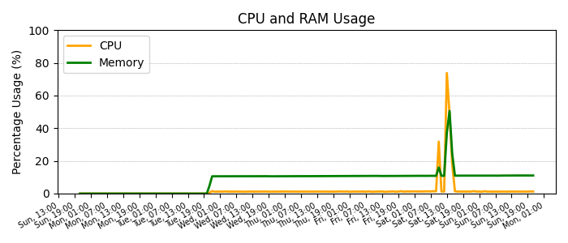
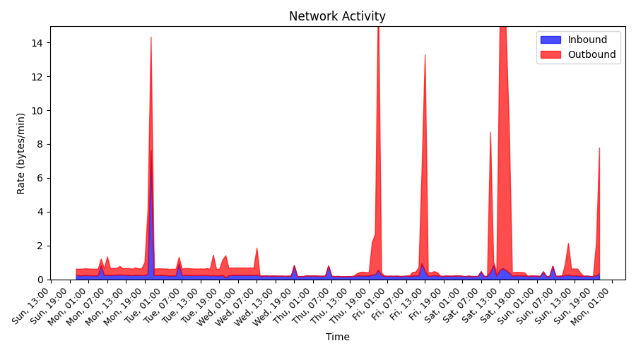

# telemetry-publisher Plotter

This directory from the [telemetry-publisher](https://github.com/nandoabreu/telemetry-publisher) project
is an independent mini project to create static plots from data published with its parent project.

The code in this directory has its own dependencies and settings.

> Network and broker variables must be set in the [toml.env](toml.env) file.


## Samples

### Usage data plot



### Networking data plot



## Installation

To start creating plots, dependencies must be installed, preferably contained in this same directory.
This was designed like this because this is are extras, not required b the purpose of the project.

Run the following command to install its dependencies:

```shell
cd src/plotter  # Move cursor to the plotter directory
pip install -r requirements.txt --upgrade --no-deps --target=.deps
```


## Execution

To generate the plots, the application can be manually triggered. The same line can be added to crontab.

**Update the vars in the [toml.env](toml.env) file before running this app.**

```shell
cd src/plotter  # Move cursor to the plotter directory
PYTHONPATH=.deps ./create.py
```
